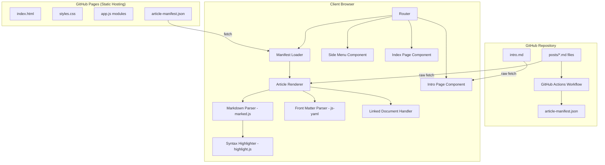
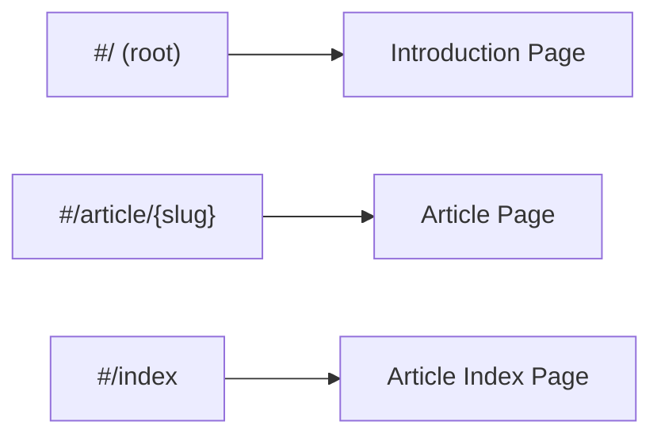
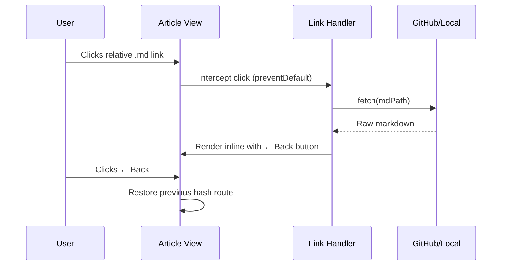
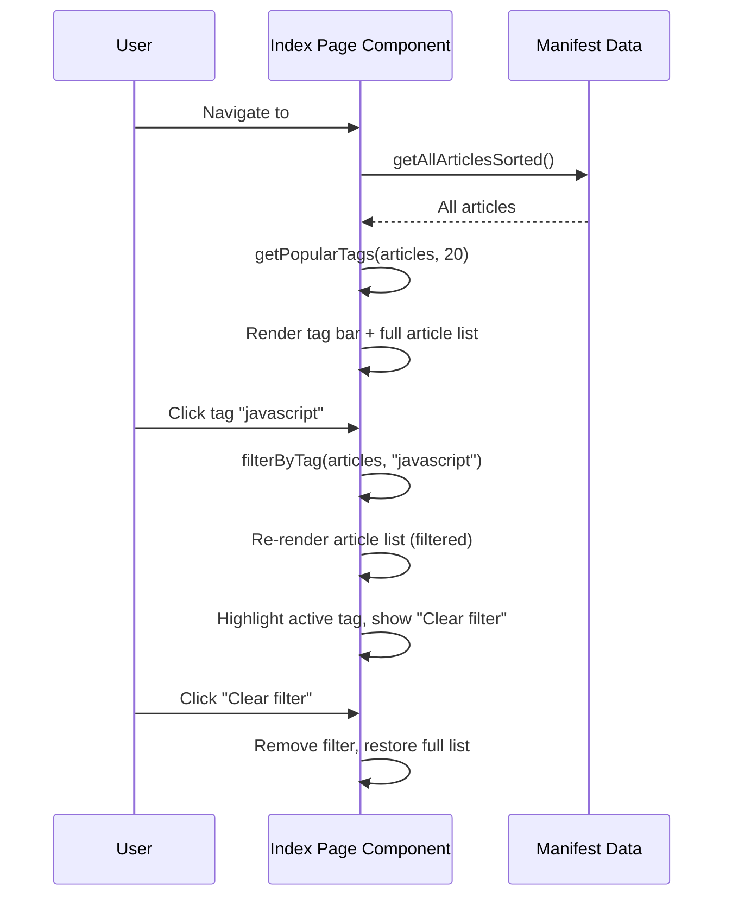

# Design Document

## Overview

This design describes a client-side technical blog application hosted on GitHub Pages. The system uses a pre-generated Article Manifest (JSON) to discover articles, fetches raw markdown files from the repository at runtime, and renders them in the browser using JavaScript. No server-side processing or build step is required when publishing new content — the author pushes a markdown file, a GitHub Actions workflow regenerates the manifest, and the blog picks up the new article on the next page load.

### Key Design Decisions

1. **Vanilla JavaScript with ES Modules** — No framework (React, Vue, etc.) is needed. The application is simple enough that vanilla JS with ES modules keeps the bundle small and eliminates build tooling for the client code.
2. **marked.js for Markdown Parsing** — A lightweight, well-maintained markdown parser that runs in the browser and supports GFM (GitHub Flavored Markdown).
3. **highlight.js for Syntax Highlighting** — Zero-dependency syntax highlighter with broad language support, integrates directly with marked.js via a custom renderer.
4. **js-yaml for Front Matter Parsing** — Standalone YAML parser that works in the browser for extracting article metadata.
5. **Hash-based Client-Side Routing** — Uses `window.location.hash` for navigation, avoiding the need for server-side URL rewriting on GitHub Pages.
6. **Article Manifest Pattern** — A JSON file generated by GitHub Actions lists all articles and their metadata, eliminating the need for the client to crawl the repository or use the GitHub API (which has rate limits).
7. **Linked Document Interception** — Relative `.md` links within articles are intercepted at click time and rendered inline with a back button, keeping the reader in context without a full page navigation.
8. **Forced Scrollbar for Layout Stability** — The `html` element always shows `overflow-y: scroll` to prevent horizontal layout shifts when navigating between pages with different content heights.
9. **Client-Side Tag Filtering** — Tag filtering on the Article Index page is performed entirely in-memory from the cached manifest data. No server round-trip is needed. The tag bar shows the top 20 tags by article count, and filtering re-renders the article list in-place without a route change.

### Research Summary

- **marked.js** (v16.x): Available via CDN (cdnjs, jsdelivr). Supports custom renderers for integrating syntax highlighting. Works in browser and Node.js. ([marked.js.org](https://marked.js.org))
- **highlight.js** (v11.x): Available via CDN. Supports 190+ languages. Provides multiple themes including ones suitable for grey/white palettes. Zero dependencies. ([highlightjs.org](https://highlightjs.org))
- **js-yaml** (v4.x): YAML 1.2 parser available via CDN. Fast and browser-compatible. ([github.com/nodeca/js-yaml](https://github.com/nodeca/js-yaml))
- **GitHub raw content**: Files can be fetched directly via `https://raw.githubusercontent.com/{owner}/{repo}/{branch}/{path}` — no API token required for public repositories.
- **Vite** (v6.x): Fast development server with hot module replacement, used for local preview. No production build step needed since the app is served as static files. ([vitejs.dev](https://vitejs.dev))

## Architecture

### System Architecture Diagram



### Routing Architecture



The application uses hash-based routing (`#/path`) to enable client-side navigation without server configuration. GitHub Pages serves the same `index.html` for all requests, and the JavaScript router reads the hash to determine which view to render.

### Linked Document Flow



### Data Flow

1. **Page Load**: Browser loads static assets (HTML, CSS, JS) from GitHub Pages
2. **Manifest Fetch**: Client fetches `article-manifest.json` from the same origin
3. **Route Resolution**: Router reads `window.location.hash` and determines the view
4. **Content Fetch**: For article views, client fetches the raw `.md` file from the repository
5. **Rendering**: Markdown is parsed, front matter extracted, syntax highlighting applied, and HTML injected into the content area
6. **Link Interception**: Relative `.md` links in rendered content are intercepted; clicking them fetches and renders the linked document inline with a back button
7. **Tag Filtering**: On the Article Index page, tags are aggregated from all articles, the top 20 by count are displayed in a tag bar, and clicking a tag filters the article list in-place

### Tag Filtering Flow



#### Tag Popularity Algorithm

1. Iterate all articles in the manifest
2. For each article, iterate its `tags` array (if present)
3. Accumulate a count per unique tag (case-insensitive comparison)
4. Sort tags by count descending; for ties, sort alphabetically ascending
5. Return the top N tags (default N=20)

## Components and Interfaces

### Module Structure

```
blog/
├── index.html              # Single HTML entry point (cache-control meta tags)
├── css/
│   └── styles.css          # All styles (layout, typography, responsive, scrollbar)
├── js/
│   ├── app.js              # Entry point, initializes router
│   ├── router.js           # Hash-based router
│   ├── manifest.js         # Fetches and caches article manifest
│   ├── renderer.js         # Markdown rendering pipeline
│   ├── frontmatter.js      # YAML front matter extraction
│   ├── components/
│   │   ├── header.js       # Header component (logo display)
│   │   ├── footer.js       # Footer component (copyright)
│   │   ├── sidemenu.js     # Side menu with latest articles, home & index links
│   │   ├── article.js      # Single article view + linked document handling
│   │   ├── index-page.js   # Article index listing
│   │   └── intro.js        # Introduction page
│   └── utils/
│       └── slug.js         # URL slug generation
├── posts/                  # Article markdown files (recursive)
│   └── *.md
├── intro.md                # Introduction page content
├── article-manifest.json   # Generated manifest
├── package.json            # Dev dependencies and scripts
├── vitest.config.js        # Test configuration
├── .github/
│   └── workflows/
│       └── build-manifest.yml  # GitHub Actions workflow
└── scripts/
    └── build-manifest.js   # Manifest generation script (Node.js)
```

### Component Interfaces

#### Router (`js/router.js`)

```typescript
interface Route {
  pattern: string;       // e.g., "/article/:slug"
  handler: (params: Record<string, string>) => void;
}

// Public API
function initRouter(routes: Route[]): void;
function navigate(path: string): void;
function getCurrentRoute(): { path: string; params: Record<string, string> };
```

#### Manifest Loader (`js/manifest.js`)

```typescript
interface ArticleEntry {
  path: string;          // Relative file path, e.g., "posts/my-article.md"
  title: string;
  date: string;          // ISO 8601 date (YYYY-MM-DD)
  author: string;
  description: string;
  tags: string[];
  slug: string;          // Generated URL slug
}

// Public API
async function loadManifest(): Promise<ArticleEntry[]>;
function getLatestArticles(count: number): ArticleEntry[];
function getArticleBySlug(slug: string): ArticleEntry | null;
function getAllArticlesSorted(): ArticleEntry[];
function sortByDateDescending(articles: ArticleEntry[]): ArticleEntry[];
function getPopularTags(articles: ArticleEntry[], maxCount: number): TagCount[];
function filterByTag(articles: ArticleEntry[], tag: string): ArticleEntry[];
```

#### Tag Filtering Types

```typescript
interface TagCount {
  tag: string;           // Tag name (lowercase)
  count: number;         // Number of articles with this tag
}
```

#### Front Matter Parser (`js/frontmatter.js`)

```typescript
interface FrontMatter {
  title: string;
  date: string;
  author: string;
  description?: string;
  tags?: string[];
}

interface ParsedArticle {
  frontMatter: FrontMatter | null;
  content: string;       // Markdown content without front matter
}

// Public API
function parseFrontMatter(rawMarkdown: string): ParsedArticle;
function validateFrontMatter(fm: Record<string, unknown>): { valid: boolean; errors: string[] };
```

#### Renderer (`js/renderer.js`)

```typescript
// Public API
function renderMarkdown(markdown: string): string;  // Returns HTML string
function configureHighlighting(languages: string[]): void;
```

#### Slug Utility (`js/utils/slug.js`)

```typescript
// Public API
function generateSlug(filePath: string): string;
```

#### Header Component (`js/components/header.js`)

```typescript
// Public API
function renderHeader(): void;
```

The header renders the logo image (`assets/images/logo.png`) as a static, non-clickable `` element (no wrapping `<a>` tag). The logo is aligned left within a 150px-tall header and scaled to fit.

#### Index Page Component (`js/components/index-page.js`)

```typescript
// Public API
function renderIndexPage(): void;
function formatDate(dateStr: string): string;

// Tag filtering (internal)
function getPopularTags(articles: ArticleEntry[], maxCount: number): TagCount[];
function filterByTag(articles: ArticleEntry[], tag: string): ArticleEntry[];
function renderTagBar(tags: TagCount[], activeTag: string | null): string;
function setTagFilter(tag: string | null): void;
```

#### Article Component (`js/components/article.js`)

```typescript
// Public API
function renderArticle(slug: string): Promise<void>;
function formatDate(isoDateString: string): string;

// Internal (linked document handling)
function renderLinkedMd(mdPath: string, backHash: string): Promise<void>;
function attachMdLinkHandlers(container: HTMLElement, currentHash: string): void;
```

#### Side Menu Component (`js/components/sidemenu.js`)

```typescript
// Public API
function renderSideMenu(articles: ArticleEntry[]): HTMLElement | null;
function updateSideMenu(articles: ArticleEntry[]): void;
```

### External Dependencies

| Library | Version | Purpose | Delivery |
|---------|---------|---------|----------|
| marked | ^16.0.0 | Markdown to HTML conversion | npm (ES module) |
| highlight.js | ^11.9.0 | Code syntax highlighting | npm |
| js-yaml | ^4.1.0 | YAML front matter parsing | npm |
| vite | ^6.3.0 | Development server | npm (dev only) |
| vitest | ^3.1.0 | Test runner | npm (dev only) |
| fast-check | ^3.15.0 | Property-based testing | npm (dev only) |
| jsdom | ^29.1.1 | DOM simulation for tests | npm (dev only) |

## Data Models

### Article Manifest Schema (`article-manifest.json`)

```json
{
  "generatedAt": "2024-01-15T10:30:00Z",
  "articles": [
    {
      "path": "posts/getting-started-with-rust.md",
      "title": "Getting Started with Rust",
      "date": "2024-01-15",
      "author": "Jane Developer",
      "description": "A beginner's guide to the Rust programming language",
      "tags": ["rust", "programming", "beginner"],
      "slug": "posts/getting-started-with-rust"
    }
  ]
}
```

### Front Matter Schema

```yaml
---
title: "Article Title"          # Required, string, 1-200 chars
date: "2024-01-15"             # Required, ISO 8601 (YYYY-MM-DD)
author: "Author Name"          # Required, string, 1-100 chars
description: "Short summary"   # Optional, string, 1-500 chars
tags:                          # Optional, list of 1-10 strings
  - "tag1"                     # Each tag: 1-50 chars
  - "tag2"
---
```

### URL Slug Generation Rules

| Input | Output |
|-------|--------|
| `posts/My First Article.md` | `posts/my-first-article` |
| `posts/sub dir/Article!Name.md` | `posts/sub-dir/article-name` |
| `posts/hello---world.md` | `posts/hello-world` |
| `posts/café & code.md` | `posts/caf-code` |

Algorithm:
1. Remove `.md` extension
2. Convert to lowercase
3. Replace spaces and consecutive special characters with a single hyphen
4. Remove non-alphanumeric characters (except hyphens and forward slashes)
5. Collapse consecutive hyphens into one
6. Trim leading/trailing hyphens from each path segment

### Application State

The client maintains minimal in-memory state:

```typescript
interface AppState {
  manifest: ArticleEntry[] | null;   // Cached manifest data
  currentRoute: string;               // Current hash route
  isLoading: boolean;                  // Loading indicator state
}
```

No persistent client-side state is needed beyond the browser's HTTP cache for fetched resources.

### Cache-Control Configuration

The HTML document includes meta tags to prevent stale content:

```html
<meta http-equiv="Cache-Control" content="no-cache, no-store, must-revalidate">
<meta http-equiv="Pragma" content="no-cache">
<meta http-equiv="Expires" content="0">
```

### Tag Bar UI Specification

The tag bar is rendered at the top of the Article Index page, above the article list.

**Structure:**
```html
<div class="tag-bar">
  <span class="tag-item active" data-tag="javascript">javascript (5)</span>
  <span class="tag-item" data-tag="python">python (3)</span>
  <!-- ... up to 20 tags -->
  <button class="tag-clear-filter">Clear filter</button>
</div>
```

**Behavior:**
- Tags are displayed inline (horizontally wrapping) with the article count in parentheses
- Clicking a tag sets it as the active filter and re-renders the article list
- The active tag receives a visually distinct style (e.g., highlighted background, bold text)
- A "Clear filter" button appears only when a filter is active
- Clicking "Clear filter" removes the active tag and restores the full article list
- If no articles match the active tag, a message "No articles found for tag: {tag}" is displayed in place of the article list
- If no articles in the manifest have tags, the tag bar is not rendered


## Correctness Properties

*A property is a characteristic or behavior that should hold true across all valid executions of a system — essentially, a formal statement about what the system should do. Properties serve as the bridge between human-readable specifications and machine-verifiable correctness guarantees.*

### Property 1: Front matter round-trip parsing

*For any* valid front matter object containing a title (1-200 chars), date (ISO 8601 YYYY-MM-DD), author (1-100 chars), and optionally description (1-500 chars) and tags (1-10 strings of 1-50 chars each), serializing it to YAML front matter format and then parsing it back with the front matter parser should produce an object with identical field values.

**Validates: Requirements 1.1**

### Property 2: Front matter validation rejects invalid metadata

*For any* front matter object that is missing at least one required field (title, date, or author), or contains tags exceeding 10 items, or contains a tag longer than 50 characters, or contains a description longer than 500 characters, the validation function should return invalid with error messages identifying each violation.

**Validates: Requirements 1.3, 1.5, 11.5**

### Property 3: Slug generation invariants

*For any* file path string ending in `.md`, the generated slug should satisfy all of: (a) contains no uppercase characters, (b) does not end with `.md`, (c) contains no consecutive hyphens, (d) contains only lowercase alphanumeric characters, hyphens, and forward slashes, and (e) does not start or end with a hyphen in any path segment.

**Validates: Requirements 2.3**

### Property 4: Article sorting is descending by date

*For any* list of article entries with valid ISO 8601 dates, after sorting with the article sort function, each article's date should be greater than or equal to the date of the article that follows it in the list.

**Validates: Requirements 4.3**

### Property 5: Side menu selects correct top-N articles

*For any* manifest containing N articles (N ≥ 0) with distinct dates, the side menu selection function should return exactly min(10, N) articles, all of which have dates greater than or equal to any article not in the selection, and the returned list should be sorted in descending date order.

**Validates: Requirements 5.2**

### Property 6: Date formatting produces human-readable output

*For any* valid ISO 8601 date string (YYYY-MM-DD) between 1970-01-01 and 2099-12-31, the date formatting function should produce a string containing the full month name, the numeric day, and the four-digit year.

**Validates: Requirements 4.2**

### Property 7: Rendered article metadata is present in output

*For any* valid article entry with title, author, date, and description, the rendered HTML for both the article view and the index page item should contain the title text, author text, and formatted date string as substrings.

**Validates: Requirements 3.4, 4.1, 8.4**

### Property 8: Navigation links are valid hash routes

*For any* article entry in the manifest, the generated navigation link should be a string starting with `#/` and containing only valid URL characters (lowercase alphanumeric, hyphens, forward slashes).

**Validates: Requirements 3.5**

### Property 9: Manifest builder produces correct entries for valid files

*For any* set of markdown files with valid front matter placed in the content directory, the manifest builder should produce a JSON output containing exactly one entry per valid file, where each entry includes the correct file path, title, date, author, description, tags, and a valid slug.

**Validates: Requirements 11.2, 11.3**

### Property 10: Syntax highlighting produces styled elements

*For any* non-empty code string and any supported language identifier (javascript, python, typescript, html, css, bash), the syntax highlighting function should produce HTML output containing at least one `<span>` element with a `class` attribute (indicating token classification).

**Validates: Requirements 10.1**

### Property 11: Tag popularity selection returns correct top-N tags with counts

*For any* list of articles with tags, the tag popularity function should return at most 20 tags, each with a count equal to the number of articles containing that tag, sorted by count descending (with alphabetical tiebreaker), and no excluded tag should have a count greater than any included tag.

**Validates: Requirements 17.1, 17.2**

### Property 12: Tag filtering returns exactly matching articles

*For any* list of articles and any tag that appears in at least one article, filtering by that tag should return exactly the set of articles whose tags array contains the selected tag, preserving the descending date sort order.

**Validates: Requirements 17.3**

## Error Handling

### Client-Side Errors

| Error Scenario | Handling Strategy | User Impact |
|---|---|---|
| Article manifest fetch fails (network error, 404) | Display error message in content area, retry with exponential backoff (max 3 attempts) | User sees "Unable to load articles" message with retry option |
| Individual article fetch fails | Display error in content area with link back to index | User can navigate to other articles |
| intro.md fetch fails (missing file) | Display default welcome message | User sees fallback introduction |
| Linked .md file fetch fails | Display error in content area with ← Back button | User can return to referring article |
| Malformed YAML in front matter | Skip article, log console warning with file path | Article excluded from listings silently |
| Missing required front matter fields | Skip article, log console warning listing missing fields | Article excluded from listings |
| Unsupported code language identifier | Render as plain preformatted text | Code displays without highlighting |
| Invalid hash route (unknown path) | Redirect to root route (introduction page) | User sees introduction page |

### Manifest Generation Errors (Build Script)

| Error Scenario | Handling Strategy | User Impact |
|---|---|---|
| File read error during scan | Log warning, skip file, continue processing | File excluded from manifest |
| Invalid YAML in front matter | Log warning with file path, exclude from manifest | Article not discoverable |
| Missing required fields | Log warning listing missing fields, exclude from manifest | Article not discoverable |
| Empty content directory | Generate manifest with empty articles array | Blog shows no articles |
| Write permission error for manifest output | Exit with non-zero code, log error | GitHub Actions workflow fails, previous manifest preserved |

### Linked Document Error Handling

| Error Scenario | Handling Strategy | User Impact |
|---|---|---|
| Linked .md file returns 404 | Display "Error Loading Document" with ← Back button | User can return to the referring article |
| Linked .md file returns HTML (SPA fallback) | Treat as file not found, display error with ← Back button | User can return to the referring article |
| External .md link (http/https) | Do not intercept — allow normal browser navigation | Link opens normally |

### Graceful Degradation

- If highlight.js fails to load, code blocks render as plain preformatted text
- If the manifest is empty, the side menu shows only the Home and Index links
- If JavaScript is disabled, the page shows a `<noscript>` message directing users to enable JavaScript
- If a linked document fails to load, the back button remains functional
- If no articles have tags, the tag bar is not rendered on the Article Index page
- If a filtered tag yields no results, a "no articles found" message is displayed with the clear filter option

## Testing Strategy

### Testing Approach

This project uses a dual testing strategy combining property-based tests for universal correctness guarantees with example-based unit tests for specific scenarios and integration points.

### Property-Based Testing

**Library**: [fast-check](https://github.com/dubzzz/fast-check) (JavaScript property-based testing library)

**Configuration**:
- Minimum 100 iterations per property test
- Each test tagged with: `Feature: technical-blog, Property {number}: {property_text}`

**Properties to implement** (from Correctness Properties section):
1. Front matter round-trip parsing
2. Front matter validation rejects invalid metadata
3. Slug generation invariants
4. Article sorting is descending by date
5. Side menu selects correct top-N articles
6. Date formatting produces human-readable output
7. Rendered article metadata is present in output
8. Navigation links are valid hash routes
9. Manifest builder produces correct entries for valid files
10. Syntax highlighting produces styled elements
11. Tag popularity selection returns correct top-N tags with counts
12. Tag filtering returns exactly matching articles

### Unit Tests (Example-Based)

**Framework**: Vitest (fast, ESM-native test runner)

**Coverage areas**:
- Router: specific route matching, parameter extraction, unknown route fallback
- Front matter parser: specific valid/invalid examples including edge cases (empty strings, boundary lengths, malformed YAML)
- Slug generation: specific input/output pairs from the Data Models table
- Component rendering: specific HTML structure verification (header, footer, side menu, article view)
- Intro page: fallback message when intro.md is missing
- Linked documents: back button rendering, external link non-interception
- Error handling: specific error scenarios (network failures, missing files, invalid responses)
- Tag filtering: tag bar rendering with active state, clear filter button presence, empty results message, visual distinction of selected tag

### Integration Tests

**Scope**:
- Manifest generation script: end-to-end test with real file system (temp directory with sample .md files, nested subdirectories, invalid files)
- Full rendering pipeline: markdown input → HTML output verification including syntax highlighting
- Router + component integration: route changes trigger correct component renders
- Linked document flow: click interception → fetch → inline render → back button navigation

### Test Organization

```
tests/
├── properties/           # Property-based tests (fast-check)
│   ├── frontmatter.prop.test.js
│   ├── slug.prop.test.js
│   ├── sorting.prop.test.js
│   ├── sidemenu.prop.test.js
│   ├── dateformat.prop.test.js
│   ├── rendering.prop.test.js
│   ├── navigation.prop.test.js
│   ├── manifest.prop.test.js
│   ├── highlighting.prop.test.js
│   └── tag-filtering.prop.test.js
├── unit/                 # Example-based unit tests
│   ├── router.test.js
│   ├── frontmatter.test.js
│   ├── article.test.js
│   ├── index-page.test.js
│   ├── intro.test.js
│   ├── sidemenu.test.js
│   └── manifest.test.js
└── integration/          # Integration tests
    └── rendering-pipeline.test.js
```

### Running Tests

```bash
# Run all tests
npm test

# Run property tests only
npm run test:properties

# Run unit tests only
npm run test:unit

# Run with coverage
npm run test:coverage
```
